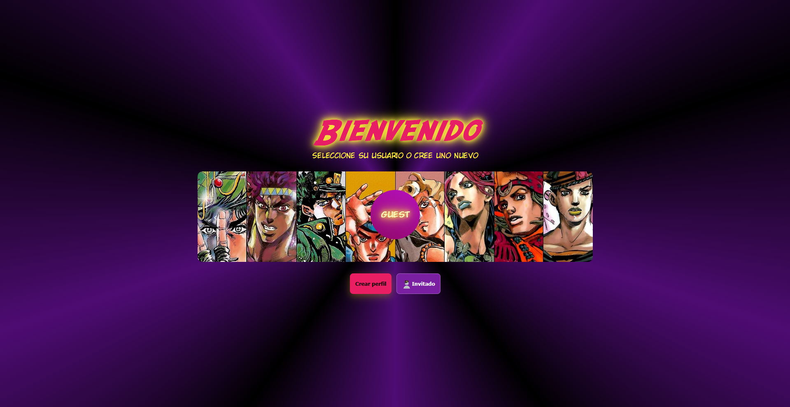
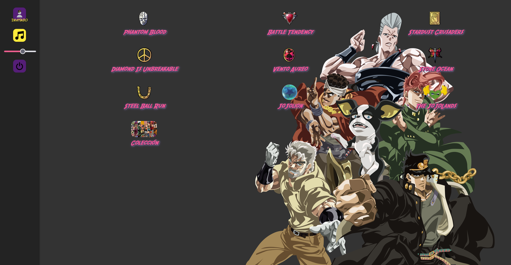
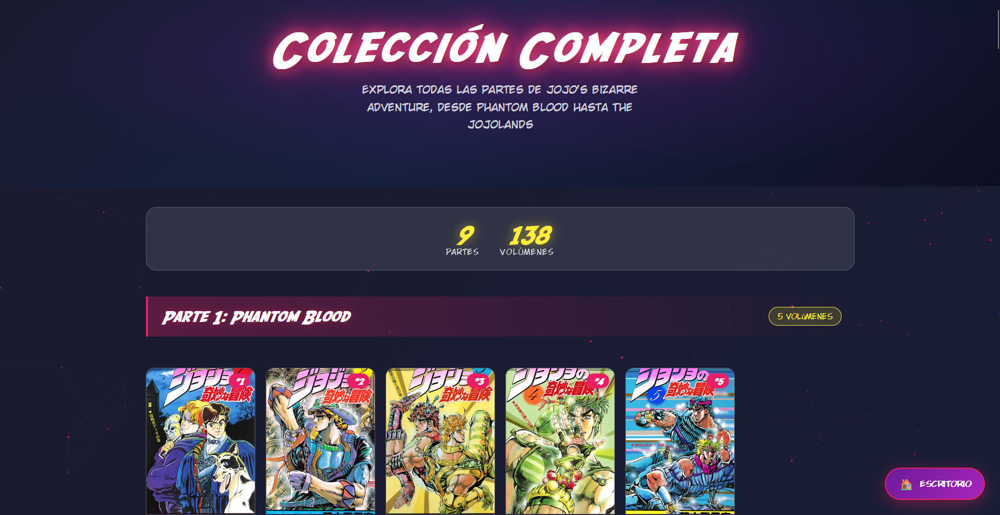
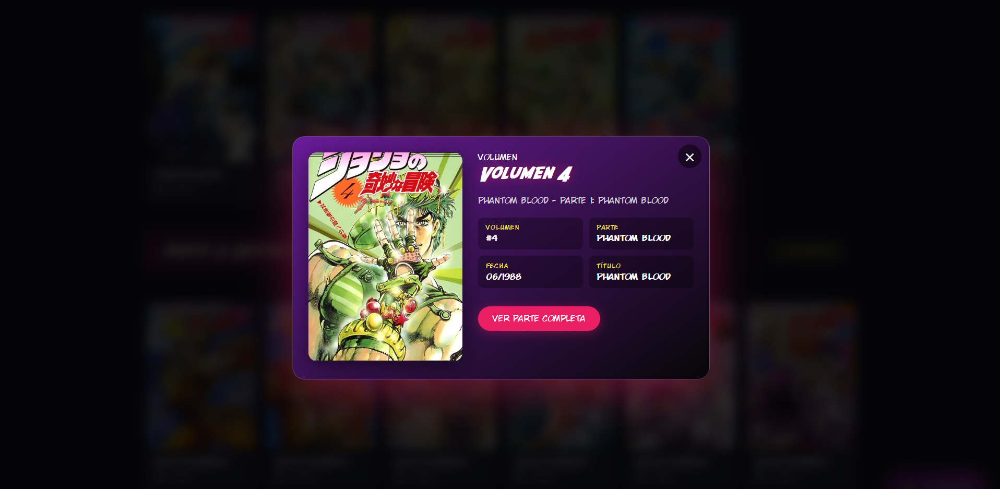

# 🖥️ Bizarre Desktop

**Bizarre Desktop** es una wiki interactiva de personajes, Stands y elementos de **JoJo's Bizarre Adventure**, presentada como un escritorio de ordenador retro.

El proyecto busca transformar una wiki convencional en una experiencia interactiva, simulando la navegación por un sistema operativo mientras se explora el universo de JoJo.

## 📖 Descripción

La aplicación permite consultar información sobre las diferentes partes de JoJo's Bizarre Adventure, sus personajes y Stands mediante una interfaz inspirada en un escritorio clásico.

El proyecto combina una interfaz web interactiva con datos estructurados en JSON y un modelo 3D de un portátil en la página de inicio.

## ✨ Características

- 📚 **Wiki interactiva** con información de las diferentes partes de JoJo's Bizarre Adventure.
- 👤 **Base de datos de personajes** con información y características de cada personaje.
- ⚡ **Catálogo de Stands** con sus tipos y usuarios.
- 🖥️ **Interfaz de escritorio** que simula un sistema operativo retro.
- 🔐 **Sistema de inicio de sesión** y gestión de sesión mediante `localStorage` y `sessionStorage`.
- 💻 **Modelo 3D interactivo** de un portátil en la página de inicio.
- 📍 **Localización** dentro de la interfaz.
- 📖 **Colección de manga** con información sobre sus diferentes volúmenes.
- 📱 **Diseño responsive** para adaptar la interfaz a diferentes tamaños de pantalla.

## 📸 Screenshots

### 🔐 Inicio de sesión



### 🖥️ Escritorio



### 📍 Localización


### 📚 Wiki y personajes


### 📖 Colección



### 📕 Volúmenes



## 🗺️ Partes disponibles

El proyecto incluye información de las 9 partes de JoJo's Bizarre Adventure:

1. **Phantom Blood** — La primera parte, ambientada en la Inglaterra victoriana.
2. **Battle Tendency** — La segunda parte, centrada en Joseph Joestar y los Hombres del Pilar.
3. **Stardust Crusaders** — La tercera parte y el viaje hacia Egipto.
4. **Diamond is Unbreakable** — La cuarta parte, ambientada en Morioh.
5. **Vento Aureo** — La quinta parte, ambientada en Italia.
6. **Stone Ocean** — La sexta parte, ambientada principalmente en la prisión Green Dolphin Street.
7. **Steel Ball Run** — La séptima parte y la carrera a través de Estados Unidos.
8. **JoJolion** — La octava parte, ambientada en el nuevo Morioh.
9. **The JoJoLands** — La novena parte, ambientada en Hawái.

## 🛠️ Tecnologías

**Frontend**
- HTML5
- CSS3
- JavaScript

**Datos**
- JSON

**3D**
- Google Model Viewer

**Desarrollo**
- Git
- GitHub
- Visual Studio Code

## 📁 Estructura del proyecto

```text
BizarreDesktop/
├── assets/
│   ├── cursores/
│   ├── font/
│   ├── imgs/
│   ├── imgsReadme/
│   └── models/
│
├── css/
│   ├── index.css
│   ├── escritorio.css
│   ├── partes.css
│   ├── sesion.css
│   └── coleccion.css
│
├── data/
│
├── js/
│   ├── index.js
│   ├── escritorio.js
│   ├── partes.js
│   ├── sesion.js
│   └── coleccion.js
│
├── coleccion.html
├── escritorio.html
├── index.html
├── partes.html
├── sesion.html
├── guiaEstilos.md
└── README.md